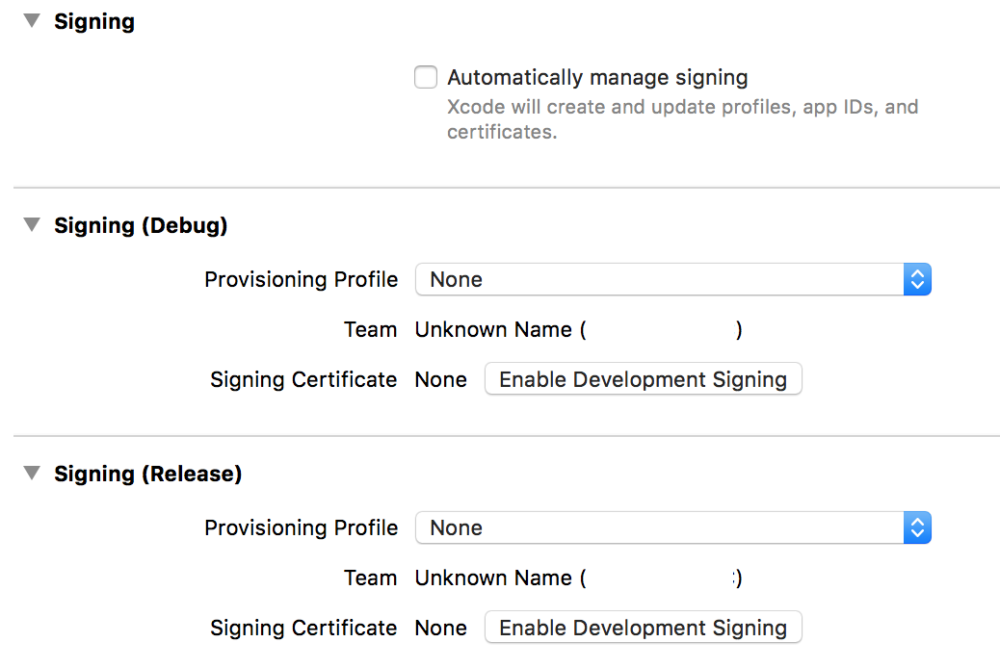
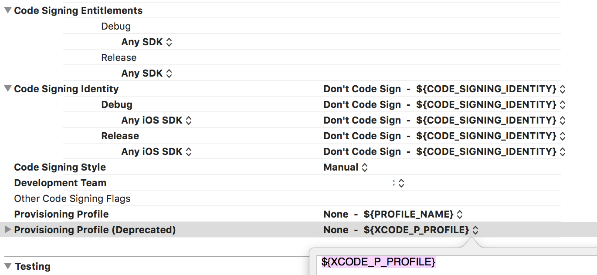

This is configurations with a number of preset things for building iOS Enterprise apps & distribute them via QR code or internet link, with slackbot integration.

It is meant to be run on macOS host.

0. Download&Install Jenkins, Xcode, qrencode.
1. Run `install_script` from root folder. !WARNING! it will erase all your previous jenkins configurations, so if you want to save them, copy /Users/Shared/Jenkins somewhere.
1.1 It opens login keychain that sits in jenkins and is used when you build. Drag&Drop your certificate here.
2. You are now logged in as jenkins in terminal (check that with `whoami`). Run `./generate_https_certificate.sh` to create local https certificates (you need https to install enterprise builds). You probably want to change parameters in the script.
2.1 You want to change /Library/Preferences/org.jenkins-ci.plist in case you've changed something
3. Run `jenkins_reload` from root folder. This will reload jenkins and print jenkins log into console. If some errors occure during startup, you will see it here.
4. Open `localhost:8080` in your browser. Jenkins should be up here.
5. Login: tester, password: test
6. Jenkins -> Manage Jenkins -> Keychains and Provisioning Profiles Management, add your profile here.
7. Jenkins -> your-project-name -> Configure, change everything with "your" to your relevant values
7.0 You might want to delete slack bot intergation, or to create webhook https://api.slack.com/tutorials/slack-apps-hello-world
7.1 Build Environment -> Keychains and Code Signing Identitites, select your profile here
7.2 You may want to setup webhook with your git system (it calls your url when someone pushes to master, triggering build)
8. Your project should look like on the pictures (grayed out team because confidentiality):

Target -> General:

Target -> Build Settings:

Enjoy :)
